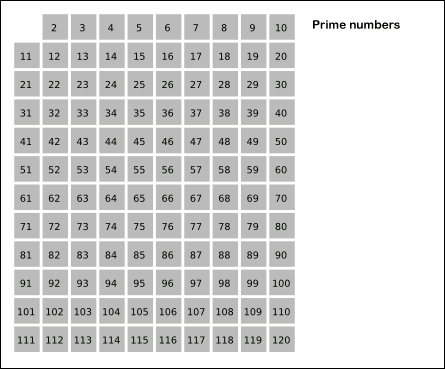

# Sieve of Erathosthenes

Problem: **Find all prime numbers in a range**

This algorithm is part of number theory. In Mathematics, the **Sieve of Erathosthenes** is an ancient alrogithm for finding prime numbers efficiently in a range. There is no efficient algorithm to find prime numbers other than brute force. We have to iterate through each number and check if it can divied the number. Although we do not need to check all the numbers, only checking till square root of n is suffice, this method is still inefficient for large volume of numbers. That's were this algorithm comes in.

## Algorithm

The algorithm goes as follows:

* At first, we initialize an array of size n, with all numbers marked as prime.
* As we loop through, whenever we encounter a prime number, we mark all subsequent multiply of that number as prime numbers
* At the end of the loop, we have an arry of prime numbers

### Code

Here is the complete algorithm:

```Java
private boolean[] sieve(int range) {
    // initialze an array, marking all the numbers as prime primarily
    boolean[] primes = new boolean[range];
    Arrays.fill(primes, true);

    // mark 0 and 1 as non prime numbers
    primes[1] = false;
    primes[0] = false;

    for (int num = 2; num <= range; num += 1) {
        // mark subsequent multiple of this prime as non-prime
        if (primes[num]) {
            int multiple = num * num;
            while (multiple <= range) {
                primes[multiple] = false;
                multiple += num;
            }
        }
    }

    return primes;

}
```

### Simulation

GIF source: [Wiki](https://en.wikipedia.org/wiki/Sieve_of_Eratosthenes#/media/File:Animation_Sieve_of_Eratosth.gif)



## Analysis

* **Time Complexity**: The algorithm has `O(n)` time complexity.
* **Space Complexity**: The algorithm stores the prime numbers in a separate array. Hence, the Space complexity of the algorithm is also `O(n)`.

## Readings

See also: [/wiki/Sieve_of_Eratosthenes](https://en.wikipedia.org/wiki/Sieve_of_Eratosthenes)
