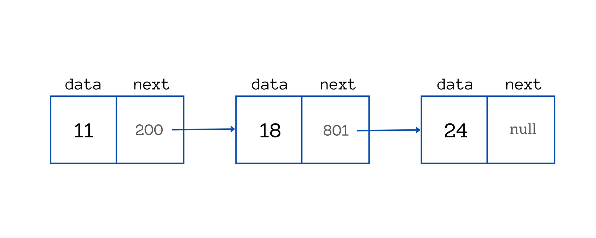

# Linked List

LinkedList is a fundamental data structure in CS that stores elements in a chain of nodes. The LinkedList or simply call `list` can be updated dynamically. A Node is the fundamental building block of a LinkedList. A node consist of the following two properties. 

1. `value` or val, that stores a value.
2. `next`, a reference (or pointer) to the next node in the chain.

The linked list always inserts values at the end of the list. `RandomAccess` for an element is not possible. Which means if you need to access a value of the linked list, then you need to traverse the whole list starting from the start of the list.


image-source: freecodecamp.org

## Base class

The base class of Linked List is `Node`. The property `val` contains value and `next` contains the reference of next node in the chain.

```Java
class Node {
    private int val;

    private Node next;

    public Node(){}

    public Node(int val) {
        this.val = val;
        this.next = null;
    }

    public Node(int val, Node next) {
        this.val = val;
        this.next = next;
    }

    public int getVal() {
        return val;
    }

    public Node getNext() {
        return next;
    }
}
```

## Basic Operations

The LinkedList has the following operations:

- `add(Object)`. Appends a new element at the end of the list.
- `remove(Object)`. Removes the specified object from the list. Returns true if the object is present, and false otherwise.
- `get(index)`. Returns the object at the specified index

### LinkedList

```Java
class LinkedList<T> {
    // internal class to keep track of the value and nex node
    private static class Node<T> {
        private final T val; // element
        private Node<T> next; // reference to next node

        public Node(T val) {
            this.val = val;
            this.next = null;
        }

        public Node(T val, Node<T> next) {
            this.val = val;
            this.next = next;
        }

        @Override
        public boolean equals(Object o) {
            if (o == null || getClass() != o.getClass()) return false;
            Node<?> node = (Node<?>) o;
            return Objects.equals(val, node.val);
        }

        @Override
        public int hashCode() {
            return Objects.hashCode(val);
        }
    }

    private final Node<T> head;
    private Node<T> tail;
    int sz = 0;

    public LinkedList() {
        this.head = new Node<>(null);
        this.tail = head;
        this.sz = 0;
    }
}
```

### Add

`add(val)` appends the element at the end of the linked list.

```Java
public void add(T val) {
    tail.next = new Node<>(val);
    tail = tail.next;
    sz += 1;
}
```

### Get

Returns the value at specified index.

```Java
public T get(int index) {
    if (index >= sz) {
        return null;
    }

    int idx = 0;
    Node<T> temp = head.next;

    while (idx++ < index) {
        temp = temp.next;
    }

    return temp.val;
}
```

### Remove

Removes the first occurance of the specified object.

```Java
public boolean remove(T val) {
    Node<T> temp = head.next;
    Node<T> prev = head;

    while (temp != null) {
        if (temp.val.equals(val)) {
            prev.next = temp.next;
            sz -= 1;
            
            return true;
        }

        prev = temp;
        temp = temp.next;
    }

    return false;
}
```

### Size

Returns the size of the linked list.

```Java
public int getSz() {
    return sz;
}
```

## Application

An array has a fixed length. However, ou can not change the size of an array. Which makes array inflexible for applications where you don't know the size in advance or you have inserts frequently. But linked lists size is dynamic and it grows over time. If there are lots of inserts and fewer read/writes, then linked list is the best option.

- Where frequent inserts and fewer reads are important
- Removing element is necessary
- Size is not fixed
