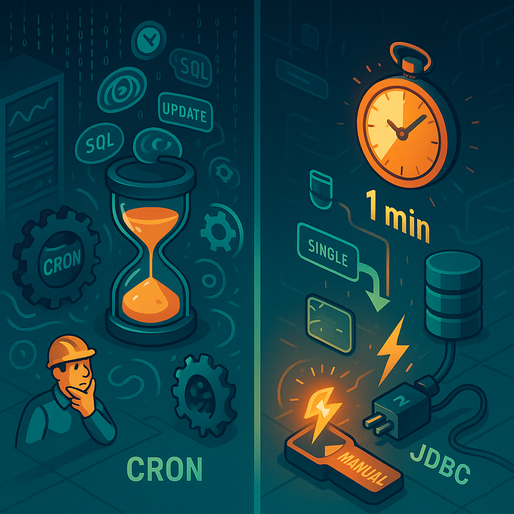

# Oh Hibernate! My Hibernate!

Recently, we were facing a significant performance drop in one of our daily report generations. The task was to aggregate all the rows added before in the past 24 hours and generate a report based on multiple matrices. Sounds easy, right? But the data size was huge. Around 150k+ rows were added each day. And the report was dependent on entities from multiple tables.

## The first problem: Server crash

One day, a notification came! The server crashed with OOM (Out of memory) error. Upon investigating, we found a huge spike in the DB when the server crashed. Lots of data were being fetched. And the server went OOM. When we further investigated, we found out that the size of each entity object was around 4.5MB. And for 150k+ rows it was roughly around 700GB!!! of memory.

After identifying the cause, we pruned some objects with entity graphs. But still, it was not enough. It required 250+ GB of memory to generate that report. So, instead of fetching all the objects at once, we fetched them in batches. Additionally, we used an iterator instead of a list, and removed it to be collected by the GC once the calculation for that object is done. And by doing this, the memory requirement dropped by around 100x. That solved our first problem.

## Then second problem: Execution time

One thing that surprised us, the report generation was delayed by 1-2 hrs everyday. (It was a new feature. So, it came  to attention after the first release!) We inspected the system. But there was no CPU, memory, or DB spike. We inspected the whole process but found nothing suspicious. Fortunately, we had a manual trigger for the task. And one day, we needed to run it immediately for some business reason. And guess what? It did not take more than 1 minute. But it was taking 2+ hours on the cron

Wat we found out was very surprising. When we triggered the task manually from the web, the request went through Hibernate’s `OpenSessionInView` interceptor. The interceptor wrapped the whole request in a single transaction. Which means, the beans were managed throughout the whole request. Hibernate picked the entities, made some changes in them, and put them back.

But when it ran through the cron invocation, the entities were isolated/detached. We enabled the SQL debugging and saw a horrible result. Hibernate was picking up every linked object and checking if it was dirty. There were tens and hundreds of extra queries to check just one dirty object. Even though most of the objects were cached, it was still a huge overhead for 150k+ entities. Hibernate was the culprit. We tried referencing, adding proxy objects, etc. None of them worked. Hibernate still picked up the linked objects one way or another. So, how did we solve the problem? Plain and simple `JDBC template`. By doing it the “hibernate” way, we faced a nightmare any engineer can face. And we went straight back to the JDBC template. And the runtime came down to just 1-2 minutes.

The large frameworks that give us abstractions at what cost? Without the proper understanding of the framework it is very difficult for someone to figure out the culprit.
